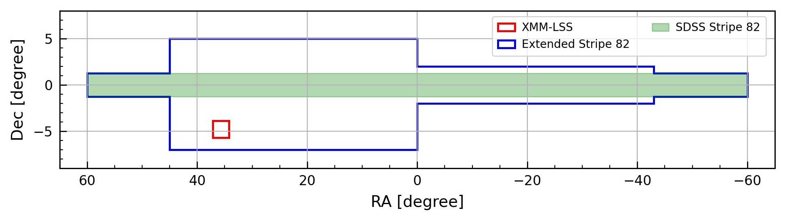

### The AGN Data Challenge
This data challenge is funded by the __LSSTC Enabling Science Program__ (for prizes). As stated in the initial proposal, this data challenge aims at "motivating planning for AGN science with the Rubin Observatory Legacy Survey of Space and Time (LSST), focusing on 1) parameterization of AGN light curves, 2) AGN selection, and 3) AGN photo-z." 

### The Dataset
The dataset released in this data challenge are pulled from different source (public archive) and put together to mimic the future LSST data release catalogs as much as possible. The column names and units used for different measurements (e.g., flux) also follow that listed in the LSST Data Products documents ([LSE-163](https://github.com/lsst/LSE-163)), see Section 4.3 for more details on the LSST data releaes catalogs. 

The objects included in the release dataset are drawn from two main survey fields, an extended Stripe 82 area and the XMM-LSS region, consist of __stars__, __quasars/AGNs__ and __galaxies__. The acutal class labels are: `Star`, `Agn`, `Qso` (for quasar), `highZQso` (for QSO high redshift) and `Gal` (for galaxy). Below are some basic statistics of this dataset. 

- Total number of objects (both combined) in the `Object` table: ~440,000
- Total number epochs in the `ForcedSource` table: ~5M

 

#### -> __Stripe 82__

|               | Agn/Qso   | highZQso   | Gal       |  Stars     |
| --------------| --------- | ---------- | ----------| ---------- |
| Lable         | ~73k      | ~1k        | ~213k     | ~106k      |
| Light Curve   | ~33k      | ~60        | ~67k      | ~87k       |
| GALEX         | ~36k      | ~10        | ~45k      | ~38k       |
| UKIDSS        | ~36k      | ~30        | ~87k      | ~92k       |
| Spitzer       | ~12k      | ~20        | ~27k      | ~30k       |
| Herschel      | ~2.5k     | ~1         | ~39k      | ~12k       |
| FIRST         | ~2k       | ~50        | ~43k      | ~250       |

#### -> __XMM-LSS__

|               | Agn/Qso   | Gal       |  Stars     |
| --------------| --------- | ----------| ---------- |
| Lable         | ~4k       | ~4k       | ~400       |
| XMM-Newton    | ~4k       | N/A       | N/A        |
| GALEX         | ~400      | ~300      | ~100       |
| VISTA/VIDEO   | ~3.5k     | ~3.5k     | ~370       |
| Spitzer       | ~3.5k     | ~3.5k     | ~350       |
| Herschel      | ~1.5k     | ~1.5k     | ~50        |

__Note:__ HighZQso are not limited to the Stripe 82 region. 

 

#### Some cavaets:
1. Not all objects in the `Object` table have labels!
1. The labels are not 100% reliable! However the labels for the objects that have a spectroscopic redshift (`z`) are more reliable. 
2. ~ 1% of the objects don't have optical fluxes (selected using multi-wavelength data).
3. Bad fits are included for the CARMA(1, 0) and CARMA(2,1) parameters. We are limited by the temporal sampling and the S/N of the existing data!

### Data Contributors:
- Qingling Ni: [XMM-SERVS](https://personal.psu.edu/wnb3/xmmservs/xmmservs.html)
- Matthew Temple: UKIDSS
- Raphael Shirley & Mandra Banerji: HSC/VISTA jointly processed catalog
- Veronique Buat: Herschel