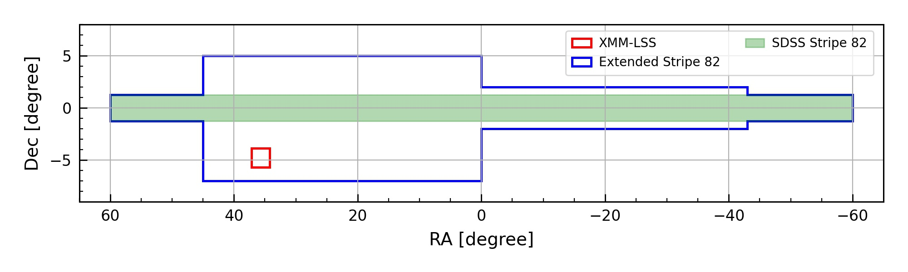

## About
This page contains the information for the _**LSSTC Enabling Science: AGN data challenge**_ as proposed by the LSST Active Galactic Nuclei (AGN) Science Collaboration in the Summer of 2020. 

<!-- The dataset that will be released in this data challenge is drawn heavily from a [training set](https://github.com/RichardsGroup/LSST_training) constructed to facilitate AGN classification in LSST.  -->

## The DataSet
The sources included in this dataset are coming from two main survey regions: **SDSS Stripe 82 (S82)** and **XMM-LSS**. The S82 region has been redefined to maximize the overlaps with the Dark Energy Survey (DES). The footprint for these two regions are:

#### _Stripe 82_

| RA         | Dec           |
| ---------- | ------------- |
| (-60, -43] | (-1.25, 1.25) |
| (-43, 0]   | (-2, 2)       |
| (0, 45]    | (-7, 5)       |
| (45, 60)   | (-1.25, 1.25) |

#### _XMM-LSS_

| RA             | Dec            |
| -------------- | -------------- |
| [34.2, 37.125] | [-5.72, -3.87] |

## Data Available
#### _Stripe 82_  (QSOs, stars, galaxies)
- __Labels__: SDSS (spectra)
- __Photometry__: GALEX (NUV and FUV), SDSS (optical), DES DR2 (optical), UKIDSS (NIR), Spitzer/SpIES (MIR)
- __Astrometry__: Gaia (proper motion and parallax); NOIRLab Source Catalog (NSC) DR2 (proper motion)
- __Time Domain__: SDSS light curves

#### _XMM-LSS_ (QSOs, stars, galaxies)
- __Labels__: XMM-SERVS(X-ray), SDSS (spectra)
- __Photometry__: GALEX (NUV and FUV), SDSS (optical), DES DR2 (optical), HSC-SSP (optical), VISTA (NIR), Spitzer/DeepDrill (MIR)
- __Astrometry__: Gaia (proper motion and parallax); NOIRLab Source Catalog (NSC) DR2 (proper motion)

### Support or Contact
If you have any questions related to this data challenge, please do not hesitate to contact Gordon Richards (<gtr@physics.drexel.edu>) or Weixiang Yu (<wy73@drexel.edu>) for more technical questions.
